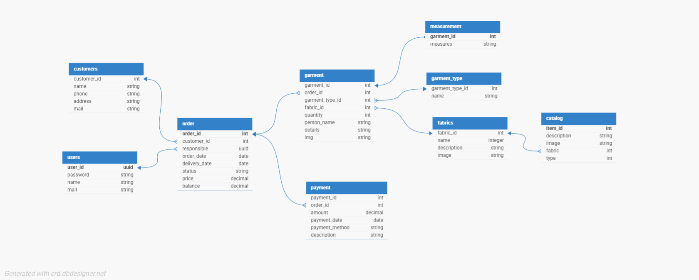
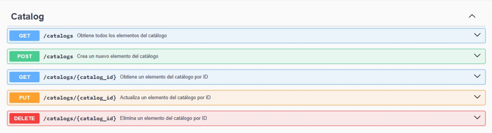
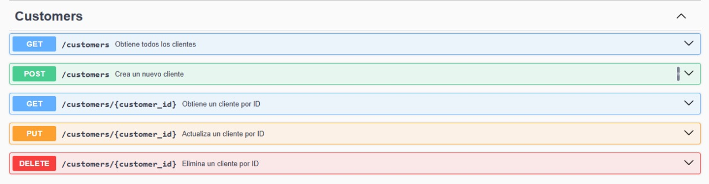
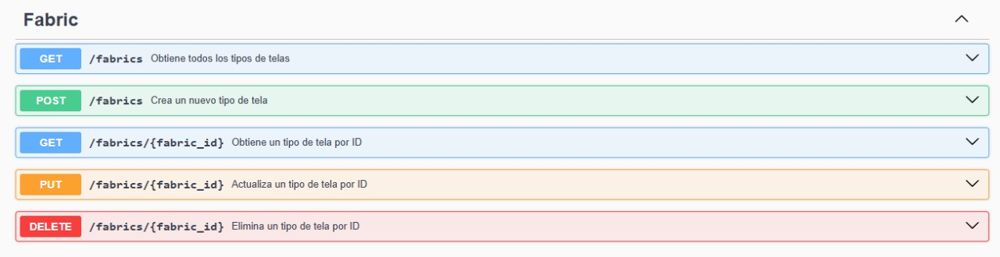
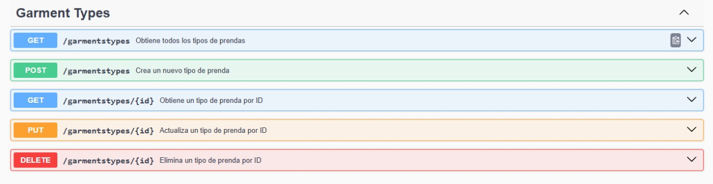
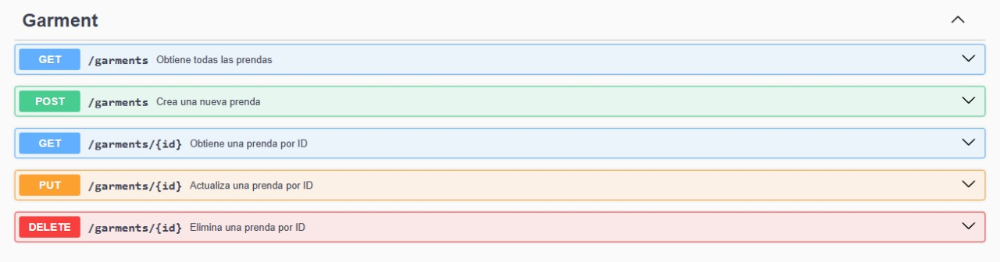
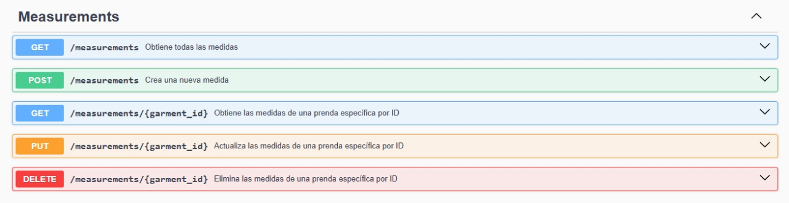
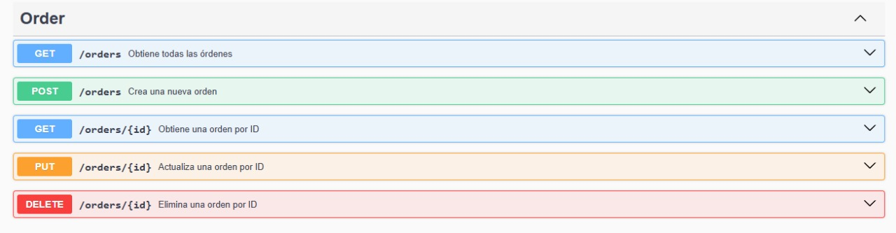
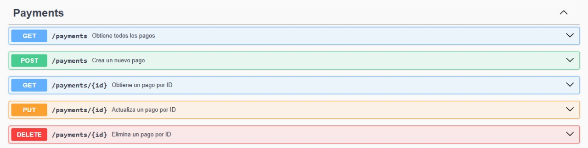

# TailorShop Management System

The **TailorShop Management System** is a backend application designed to manage the operations of a tailor shop. It provides APIs to handle various entities such as garments, catalogs, orders, payments, and measurements. The system is built using Node.js, Express, Sequelize for an easier database management and Docker for contenerization.

## Features

- **Catalog Management**: Manage items in the catalog, including descriptions, images, fabrics, and garment types.
- **Garment Management**: Track garments associated with orders, including details, fabrics, and quantities.
- **Order Management**: Handle customer orders and their associated garments.
- **Payment Management**: Manage payments for orders.
- **Measurement Management**: Store and retrieve measurements for garments.
- **Customers Management**: Manage customer information, including names, contact details.
- **Fabric Management**: Handle fabric details.
- **Garments Type**: Manage different types of garments, such as pants, dresses, and their associated attributes.


## Entity-relationship diagram


## Technologies Used

- **Node.js**: Backend runtime environment.
- **Express.js**: Web framework for building RESTful APIs.
- **Sequelize**: ORM for database management.
- **Swagger**: API documentation and testing.
- **PostgreSQL**: Relational database for storing data.
- **Docker**: Contenerization

## Project Structure
```bash
tailorshop-management/
├── Backend/
│   ├── node_modules/
│   ├── src/
│   │   ├── config/
│   │   │   ├── database.js
│   │   │   ├── swagger.js
│   │   ├── controllers/
│   │   ├── models/
│   │   ├── routes/
│   │   ├── services/
│   │   └── server.js
│   ├── .env
│   ├── .gitignore
│   ├── Dockerfile
│   ├── package-lock.json
│   ├── package.json
├── Frontend/
├── docker-compose.yml
└── README.MD
```
## How to run

A. If you just want to check the API:
1. **Clone the Repository**
git clone https://github.com/Carlolus/tailorshop-management.git
2. cd cd tailorshop-management
3. Do docker-compose up --build (Need docker installed)

B. If you want to modify the project:
1. **Clone the Repository**:
git clone https://github.com/Carlolus/tailorshop-management.git
cd tailorshop-management
2. Set Up Environment Variables:
    Navigate to the Backend directory.
    Create a .env file and configure the following variables:
    DB_HOST=localhost
    DB_PORT=5432
    DB_NAME=tailorshop
    DB_USER=your_username
    DB_PASSWORD=your_password
3. Install Dependencies: Navigate to the Backend folder and install the required dependencies:
    cd Backend
    npm install
4. Do docker-compose up --build (Need docker installed)

## Swagger API documentation

1. Catalog  
   

2. Customers  
   

3. Fabrics  
   

4. Garment Types  
   

5. Garment  
   

6. Measurements  
   

7. Orders  
   

8. Payments  
   